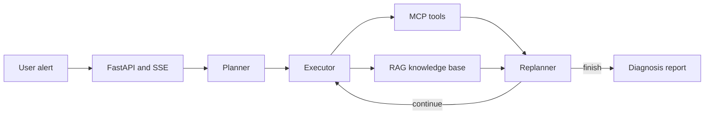

# SuperBizAgent

A reproducible AIOps diagnostic agent built with LangGraph, FastAPI, MCP, Milvus and RAG.

SuperBizAgent turns an alert into a structured diagnosis through a **Plan-Execute-Replan** workflow. It plans an investigation, calls monitoring and log tools, revises the plan from observations, retrieves operational knowledge, and streams the final report to the browser.

> This is a portfolio and research project. The bundled MCP servers use deterministic local simulation data so the full Agent workflow can be reproduced without access to a production monitoring platform.

## Highlights

- LangGraph-based Planner, Executor and Replanner workflow
- MCP tools for metrics, logs, deployments and historical tickets
- Milvus-backed RAG knowledge base with document upload
- FastAPI endpoints and SSE streaming output
- Multi-turn sessions with LangGraph checkpoints
- Retrieval and end-to-end Agent evaluation scripts
- Local Web interface for chat and AIOps diagnosis

## Architecture



## Tech stack

- **Agent:** LangGraph, LangChain, Qwen
- **Backend:** Python, FastAPI, SSE
- **Tools:** MCP / FastMCP
- **Knowledge base:** Milvus, DashScope Embedding
- **Engineering:** Docker Compose, uv

## Quick start

### Requirements

- Python 3.11+
- Docker Desktop or Docker Engine
- A DashScope API key

### 1. Configure the project

```bash
git clone https://github.com/Mengl588/superbiz-agent.git
cd superbiz-agent
cp .env.example .env
```

Set `DASHSCOPE_API_KEY` in `.env`, then install dependencies:

```bash
pip install uv
uv sync
```

### 2. Start Milvus

```bash
docker compose -f vector-database.yml up -d
```

### 3. Start the MCP servers

Open two terminals:

```bash
uv run python mcp_servers/cls_server.py
```

```bash
uv run python mcp_servers/monitor_server.py
```

### 4. Start the API

```bash
uv run uvicorn app.main:app --host 0.0.0.0 --port 9900
```

Open:

- Web UI: <http://localhost:9900>
- API docs: <http://localhost:9900/docs>

Windows users can also run `start-windows.bat` after completing the configuration.

## Main endpoints

| Method | Endpoint | Purpose |
|---|---|---|
| `POST` | `/api/chat` | Standard RAG chat |
| `POST` | `/api/chat_stream` | Streaming chat |
| `POST` | `/api/aiops` | Streaming AIOps diagnosis |
| `POST` | `/api/upload` | Upload and index a document |
| `GET` | `/health` | Service and Milvus health check |

## Evaluation

The repository includes two complementary evaluations:

- `scripts/evaluate_retrieval.py`: evaluates document retrieval with `Hit@K`.
- `scripts/evaluate_aiops_agent.py`: evaluates 20 Agent tasks, including normal, tool-timeout and empty-result cases.

Run a one-case Agent smoke evaluation after starting the MCP servers:

```bash
uv run python scripts/evaluate_aiops_agent.py --limit 1
```

Run the retrieval evaluation after starting Milvus and indexing `aiops-docs/`:

```bash
uv run python scripts/evaluate_retrieval.py
```

Metric definitions and dataset details are documented in [`eval/README.md`](eval/README.md).

## Project structure

```text
app/           FastAPI routes, Agent graph, RAG services and tools
mcp_servers/   Reproducible monitoring and log MCP servers
aiops-docs/    Sample operational knowledge base
eval/          Retrieval and Agent evaluation datasets
scripts/       Evaluation entry points
static/        Web interface
```

## Current limitations

- Monitoring and log data are local simulations, not production telemetry.
- The in-memory LangGraph checkpoint is intended for demonstration, not distributed deployment.
- Authentication, fine-grained authorization and human approval are not included.

## License

Released under the [MIT License](LICENSE).
